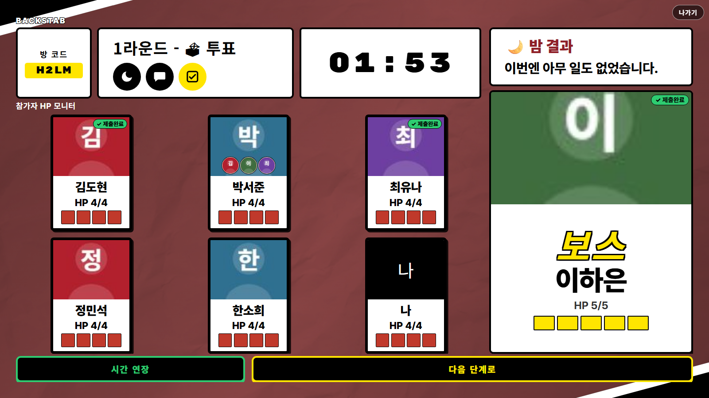
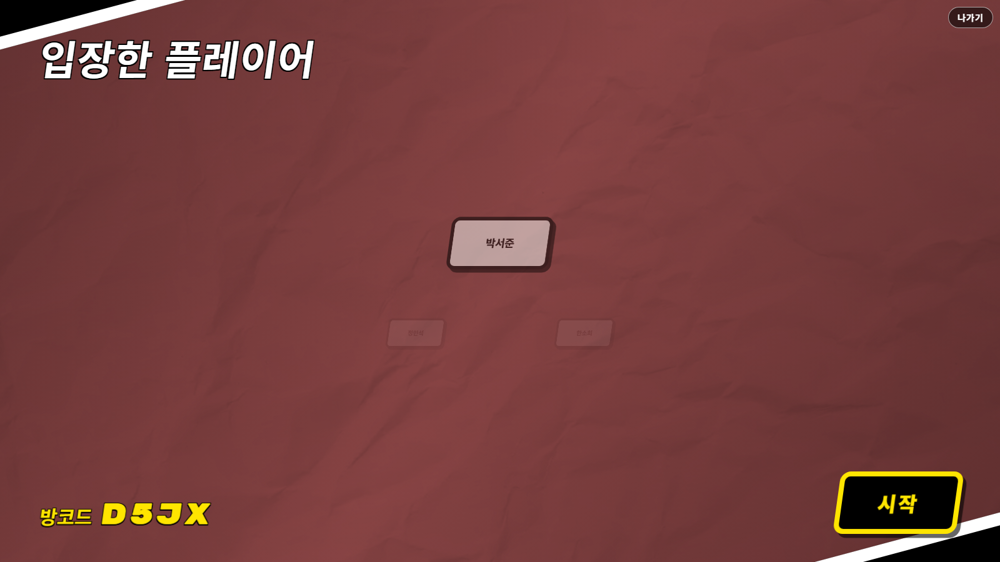
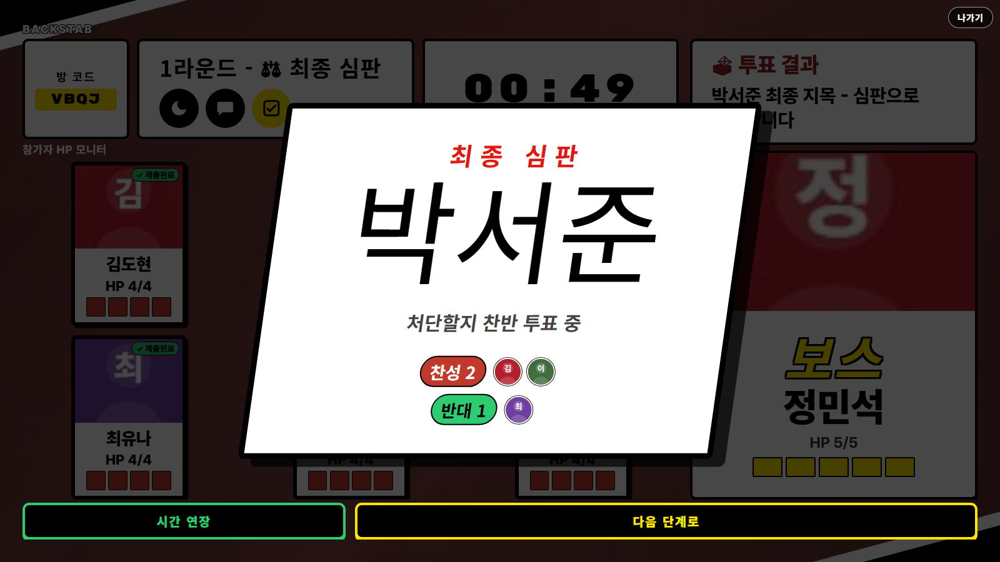
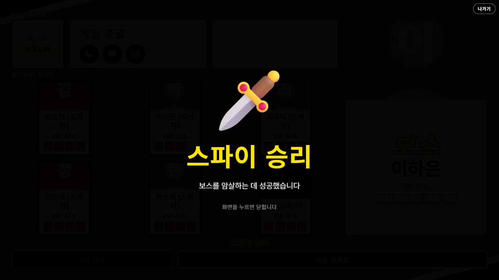
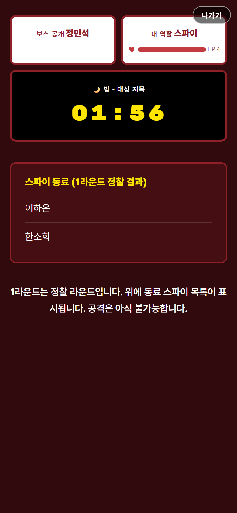
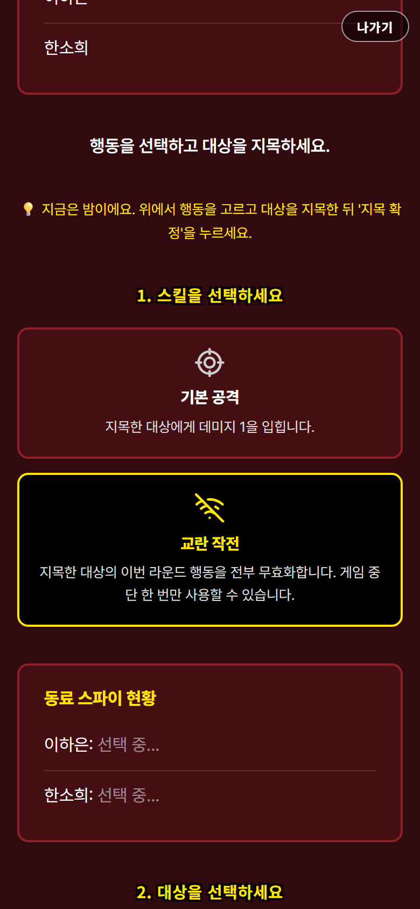
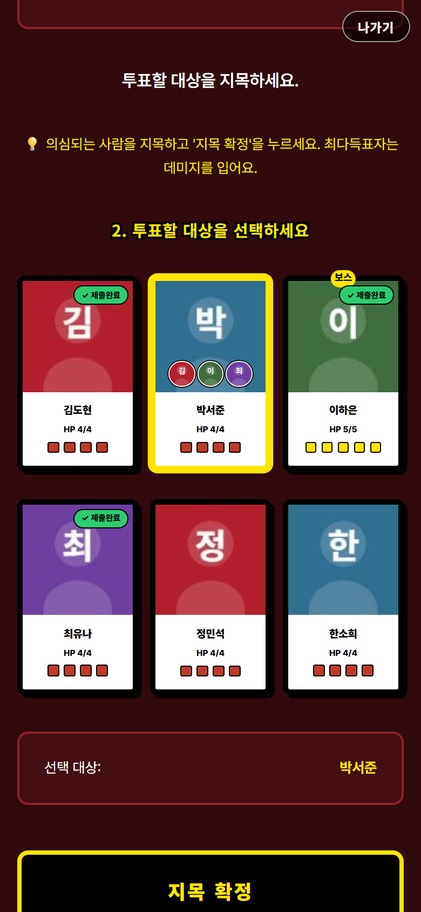

# Backstab (백스탭)

> 보스의 목을 노리는 스파이, 보스를 지키는 조직원, 그리고 **보스와 단둘이 남기를 꿈꾸는 배신자**.
> 스마트폰 하나씩 들고 6~10명이 둘러앉아 즐기는 느와르 소셜 디덕션 파티 게임.

**지금 바로 플레이 →** [backstab-tu0e.onrender.com/host](https://backstab-tu0e.onrender.com/host)

TV·노트북 화면 하나를 다 같이 보면서, 각자는 자기 폰으로 밤에 몰래 대상을 지목합니다.
설치·회원가입 없이 방 코드 4자리만 공유하면 시작됩니다.



---

## 목차

- [어떤 게임인가](#어떤-게임인가)
- [30초 요약](#30초-요약)
- [역할 4종](#역할-4종)
- [라운드 진행](#라운드-진행)
- [승리 조건](#승리-조건)
- [화면 둘러보기](#화면-둘러보기)
- [시작하는 법](#시작하는-법)
- [로컬에서 실행](#로컬에서-실행)
- [기술 구조](#기술-구조)
- [테스트](#테스트)
- [배포](#배포)
- [문서](#문서)

---

## 어떤 게임인가

마피아·인랑 계열의 심리 추리 게임이지만, 두 가지가 다릅니다.

**1. 죽거나 살거나가 아니라 HP가 깎입니다.**
한 방에 죽지 않기 때문에 "누가 맞았는가"가 매 라운드 새로운 단서가 됩니다. 스파이 3명이 같은 사람을 치면 데미지가 3으로 합산되므로, 피해량 자체가 "몇 명이 저 사람을 노렸는지"를 알려주는 정보가 됩니다.

**2. 진영이 셋이 아니라, 혼자 노는 네 번째가 있습니다.**
배신자는 스파이가 보스를 죽이면 같이 집니다. 그래서 **보스를 지켜주면서 동시에 나머지를 걷어내야** 하는, 게임에서 가장 꼬인 역할입니다.

---

## 30초 요약

| | |
|---|---|
| **인원** | 6~10명 (진행자는 인원에 포함되지 않음) |
| **한 판 소요** | 라운드당 약 10분, 보통 3~6라운드 |
| **준비물** | 다 같이 볼 화면 1개(TV·노트북) + 각자 스마트폰 |
| **설치** | 없음. 브라우저만 있으면 됩니다 |

---

## 역할 4종

인원수에 따라 구성이 자동으로 바뀝니다 (6인 기준: 보스 1 · 조직원 2 · 스파이 2 · 배신자 1 / 8인 기준: 보스 1 · 조직원 3 · 스파이 3 · 배신자 1).

### 👑 보스 — 1명 / **정체 공개**

시작하자마자 모두에게 정체가 공개됩니다. HP도 5로 혼자 높습니다. 문제는 **누가 내 편인지 모른다**는 것.

- **긴급 처형** (게임당 1회) — 지목한 대상을 남은 HP와 무관하게 **즉시 처형**합니다. 단, 조직원의 육탄 방어로는 막힙니다.

### 🛡️ 조직원 — 비공개

보스를 지키는 편이지만, **서로가 누군지 모릅니다.** 보스에게 "저 진짜 조직원이에요"를 증명해야 하는 입장.

- **육탄 방어** (쿨타임 1라운드) — 지목한 사람이 받을 데미지를 **전량 대신 받거나 절반으로 줄입니다**.
- **충성심 서약** (게임당 1회) — 이번 라운드 자신이 받는 데미지를 무효화합니다.

### 🗡️ 스파이 — 비공개 / **서로는 압니다**

1라운드 밤에 동료 스파이의 이름을 확인하고 시작합니다. 목표는 오직 보스 암살.

- **합공** — 여러 명이 같은 대상을 치면 데미지가 그대로 합산됩니다.
- **실시간 조율** — 밤에 동료가 지금 누구를 고르는 중인지 서로 볼 수 있습니다. 말 한마디 없이 합공을 맞출 수 있습니다.
- **교란 작전** (게임당 1회) — 지목한 대상의 이번 라운드 행동을 **전부 무효화**합니다.

### 🎭 배신자 — 1명 / 비공개

**보스와 단둘이 남는 순간 즉시 승리.** 다만 보스가 죽으면 그대로 패배이므로, 스파이로부터 보스를 지키면서 조직원과 스파이를 줄여야 하는 줄타기를 합니다.

- **흑막의 미소** (게임당 1회) — 이번 라운드 사망자 한 명당 HP를 2 회복하고, 공격력이 오릅니다.

---

## 라운드 진행

```
🌙 밤 (2분)  →  💬 토론 (5분)  →  🗳️ 지목 투표 (2분)  →  ⚖️ 찬반 심판 (1분)
```

**🌙 밤** — 각자 폰으로 스킬과 대상을 동시에 지목합니다. 서버가 `방어 → 공격 → 회복` 순서로 한꺼번에 처리합니다.
※ **1라운드 밤은 정찰 라운드**입니다. 공격은 불가능하고, 스파이끼리 서로의 정체만 확인합니다.

**💬 토론** — 밤 결과(누가 몇 대 맞았는지)를 다 같이 보고 추리합니다. 앱 안에서 채팅도 가능합니다.

**🗳️ 지목 투표** — 누구를 심판대에 세울지 정합니다. **지목만으로는 아무도 다치지 않습니다.** 누가 누구를 찍었는지 실시간으로 모두에게 공개됩니다.

**⚖️ 찬반 심판** — 지목된 사람을 크게 띄우고, 처단할지 찬반을 묻습니다. **가결되어야(찬성 > 반대) 비로소 데미지 1이 들어갑니다.** 동수와 기권은 부결이고, 지목된 본인도 투표할 수 있습니다.

> 지목이 곧 처형이면 낮이 단순 다수결로 끝납니다. 심판을 한 단계 더 두면 지목된 사람의 **변론**과 그에 대한 재판단이 들어가 토론이 살아납니다.

동점이면 동점자만 놓고 즉시 재투표하고, 재투표도 동점이면 그 라운드는 피해 없이 넘어갑니다.

---

## 승리 조건

판정은 **반드시 이 순서로** 이뤄집니다.

| 순서 | 조건 | 승자 |
|---|---|---|
| ① | 보스와 배신자 **단 둘만** 생존 | 🎭 **배신자** |
| ② | 보스 사망 | 🗡️ **스파이** |
| ③ | 보스 생존 + 스파이·배신자 전멸 | 👑 **보스 · 조직원** |

배신자 판정이 맨 앞이어야 하는 이유가 있습니다. 보스 사망 판정을 먼저 두면 배신자 승리 분기는 **어떤 입력으로도 도달할 수 없는 죽은 코드**가 됩니다(배신자가 매 게임 이길 수 없는 역할이 됩니다). 실제로 이 프로젝트에서 한 번 겪고 고친 버그입니다.

또한 배신자 조건이 "보스 생존"을 전제하므로, 보스가 죽는 순간 판정이 스파이 승리로 딱 떨어져 **승자가 나오지 않는 교착 상태가 원천적으로 생기지 않습니다.**

---

## 화면 둘러보기

### 다 같이 보는 진행자 화면

<table>
<tr>
<td width="50%"><br><sub><b>대기실</b> — 방 코드를 띄워두면 각자 폰으로 들어옵니다.</sub></td>
<td width="50%"><br><sub><b>투표</b> — 누가 누구를 찍었는지 카드 위에 실시간으로 쌓입니다.</sub></td>
</tr>
<tr>
<td><br><sub><b>최종 심판</b> — 지목된 사람을 수배 포스터처럼 띄우고 찬반을 묻습니다.</sub></td>
<td><br><sub><b>승리 발표</b> — 뒤로는 전원의 역할이 공개됩니다.</sub></td>
</tr>
</table>

### 각자 보는 폰 화면

<table>
<tr>
<td width="33%"><br><sub><b>1라운드 정찰</b> — 스파이는 동료의 이름을 확인하고 시작합니다.</sub></td>
<td width="33%"><br><sub><b>밤</b> — 스킬을 고르고, 동료 스파이가 지금 누구를 노리는지 실시간으로 봅니다.</sub></td>
<td width="33%"><br><sub><b>투표</b> — 제출 현황과 득표가 카드에 바로 표시됩니다.</sub></td>
</tr>
</table>

---

## 시작하는 법

1. **진행자 화면을 엽니다** — TV나 노트북에서 [/host](https://backstab-tu0e.onrender.com/host) → **방 만들기**
2. **방 코드를 공유합니다** — 화면에 뜬 4자리 코드를 참가자에게 알려줍니다
3. **각자 폰으로 입장** — [/player](https://backstab-tu0e.onrender.com/player) 에서 방 코드 + 이름(최대 7자) 입력. 프로필 사진도 고를 수 있습니다
4. **6명 이상 모이면 시작** — 진행자 화면의 **시작** 버튼

> **진행자 화면 없이 폰만으로도 됩니다.** `/player`에서 **"이름만 적고 새 방 만들기"** 를 누르면 방을 만든 사람이 방장이 되고, 폰 화면 하단에 **시간 연장 / 다음 단계로** 버튼이 상시로 뜹니다.

각 페이즈는 타이머가 끝나면 자동으로 넘어가지만, 진행자가 **다음 단계로**를 눌러 먼저 넘기거나 **시간 연장**으로 1분을 더 줄 수도 있습니다.

### 중간에 연결이 끊겨도 괜찮습니다

폰 화면이 꺼지거나 새로고침해도 **자동으로 원래 자리에 복귀**합니다. 이미 제출한 밤 행동과 투표도 그대로 유지됩니다. (한 번 제출한 행동·투표는 확정이라 재접속으로 바꿀 수 없습니다.)

---

## 로컬에서 실행

```bash
npm install
npm run dev
```

| 화면 | 주소 |
|---|---|
| 진행자 / 다 같이 보는 화면 | http://localhost:3000/host |
| 참가자 (폰) | http://localhost:3000/player |

같은 방에 들어오려면 참가자 기기가 같은 네트워크에 있어야 합니다. 폰으로 테스트할 때는 배포판을 쓰는 쪽이 편합니다.

---

## 기술 구조

빌드 도구 없이 굴러가는 단순한 구조입니다.

```
server/src/
├── index.ts              Express + Socket.IO 부팅
├── socketHandlers.ts     방·페이즈 상태 기계, 모든 소켓 이벤트
├── rooms.ts              방/세션 저장소 (메모리)
└── game/
    ├── types.ts          역할·페이즈 타입, 인원별 역할 구성표, 페이즈 시간
    ├── roleAssignment.ts 역할 배정
    └── resolveRound.ts   밤 전투 해석 · 투표 집계 · 승리 판정 (순수 함수)

public/                   프레임워크 없는 HTML/CSS/JS
├── host.html / host.js   진행자·TV 화면
├── player.html / player.js  참가자 화면
├── shared.js             양쪽이 같이 쓰는 렌더 헬퍼
└── style.css             느와르 테마 (컨테이너 쿼리 기반 반응형)
```

- **백엔드**: Node.js · TypeScript · Express · Socket.IO
- **프론트엔드**: 순수 HTML/CSS/JS (React 없음, 번들러 없음)
- **상태**: 전부 메모리. DB가 없어 서버가 재시작되면 진행 중인 방은 사라집니다
- **식별자**: 소켓 id를 플레이어 id로 사용하고, 재접속 시 `remapPlayerId()`로 새 소켓에 상태를 옮깁니다

게임 규칙 판정(`resolveRound.ts`)은 부수효과 없는 순수 함수로 분리해, 소켓·타이머 없이 단위 테스트로 검증합니다.

---

## 테스트

```bash
npm test          # 48개 통과
npx tsc --noEmit  # 타입 체크
```

밤 데미지 합산·방어·능력 상호작용, 투표 집계, 찬반 심판, 승리 판정, 인원별 역할 배정, 방 정리, 재접속 시 id 이관을 검증합니다.

유닛 테스트로 잡히지 않는 것(타이밍, 재접속 경쟁 상태, 실제 화면 레이아웃)은 **헤드리스 크롬을 CDP로 직접 몰아** 실제 게임을 끝까지 완주시키는 방식으로 검증합니다. 승리 조건 3종을 각각 강제로 만들고, 인원 6/8/10명 × 화면 4종 크기(데스크톱·아이패드 가로/세로·폰)에서 잘림·가로 스크롤·텍스트 넘침을 **수치로** 측정합니다.

---

## 배포

Render.com 기준입니다.

1. GitHub 저장소에 push
2. Render → **New Web Service** → 저장소 연결
3. Build Command: `npm install`
4. Start Command: `npm start`
5. `PORT`는 Render가 자동 주입합니다

---

## 문서

기획과 개발 기록은 `docs/`에 있습니다.

| 문서 | 내용 |
|---|---|
| [01게임 순서.md](docs/01게임%20순서.md) | 전체 게임 흐름 |
| [02역할.md](docs/02역할.md) | 역할별 능력·승리 조건 |
| [03라운드진행.md](docs/03라운드진행.md) | 페이즈 구조, 처리 우선순위, 승리 판정 순서 |
| [04핵심메커니즘.md](docs/04핵심메커니즘.md) | 기본 공격·능력 수치 상세 |
| [05인원세션타겟층.md](docs/05인원세션타겟층.md) | 인원별 역할 구성표 |
| [09개발메모.md](docs/09개발메모.md) | 구현하며 정한 세부 결정, 남은 일 |
| [10개발로그.md](docs/10개발로그.md) | 날짜별 개발 기록 (원인·해결 중심) |
